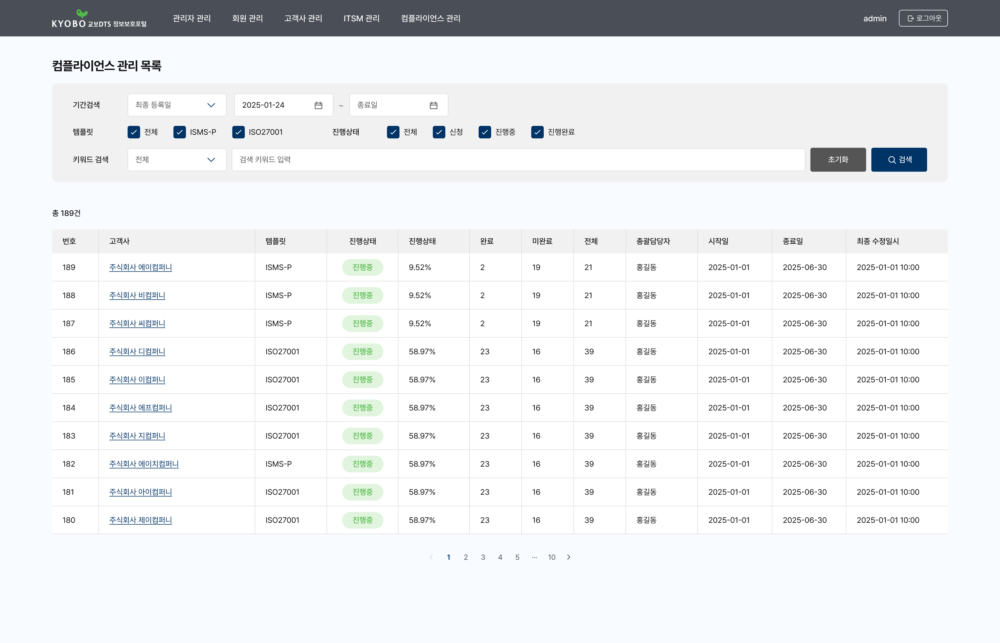
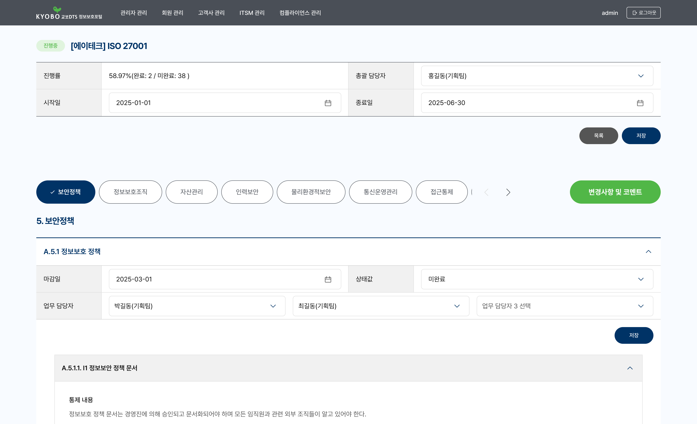
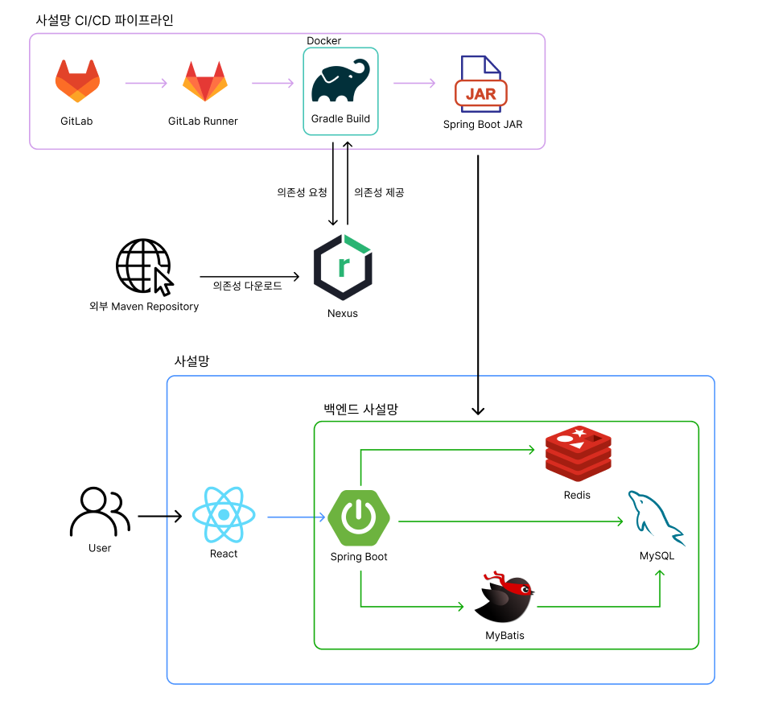
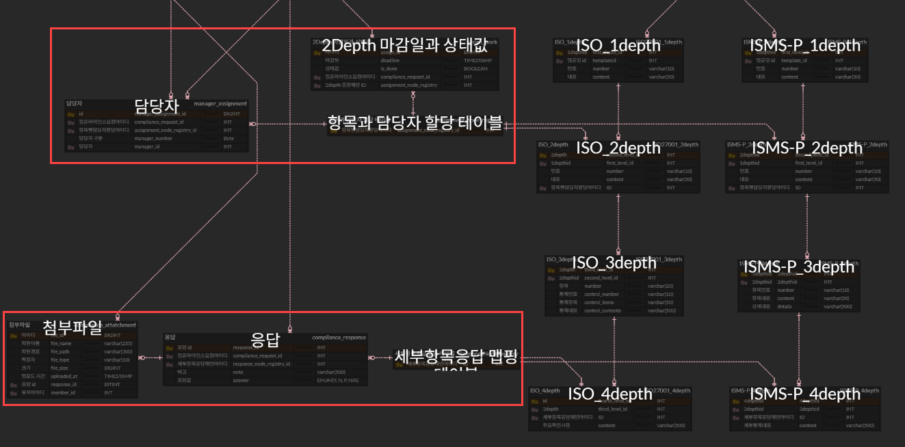

# 교보DTS 컴플라이언스 플랫폼

> 컴플라이언스 산출물을 통합 관리할 수 있는 플랫폼

📅 개발 기간: 2025.03 ~ 2025.05<br>
👤 인원: 프론트엔드 3명, 백엔드 8명<br>
💼 담당 역할: ERD 설계 및 컴플라이언스 백엔드 API 개발

<br>

<!-- 데모 스크린샷 또는 GIF를 여기에 추가하세요 -->
<!--  -->

<div align="center">
  
  
</div>

<br>

## 목차

- [프로젝트 개요](#프로젝트-개요)
- [제약사항](#제약사항)
- [아키텍처](#아키텍처)
- [기술 스택](#기술-스택)
- [트러블슈팅](#트러블슈팅)
- [회고](#회고)

<br>

## 프로젝트 개요

**문제 정의**

- 산출물 갱신 시 어디를 수정해야 하는지 파악이 어려움
- 문서별 버전이 따로 관리되어 이력 관리가 비효율적

**해결 방안**

- 분산된 Word/Excel 산출물을 하나의 플랫폼으로 일원화
- 산출물의 갱신 내역과 변경 이력을 체계적으로 추적

**핵심 기능**

- 컴플라이언스 요청 생성 및 관리
- 템플릿 기반 컴플라이언스 항목 관리
- 담당자 할당 및 업무 진행 상황 추적
- 컴플라이언스 응답 데이터 및 첨부파일 처리

<br>

## 제약사항

- 보안 요구사항에 따라 백엔드 서버, DB, Redis 등 주요 인프라를 사설망 내부에 구축해야 했습니다.
- CI/CD도 사설망 내부에서 운영해야 해서 별도로 사설 GitLab 기반의 CI/CD 파이프라인을 구축해야 했습니다.
- 소스 코드는 GitHub Private 레포지토리로 관리해야 했습니다.

<br>

## 아키텍처



<br>

## 기술 스택

| 구분           | 스택                                     |
| -------------- | ----------------------------------------- |
| 프론트엔드     | React                                     |
| 백엔드         | Spring Boot · MyBatis · MySQL · Redis     |
| 인프라         | Docker                                    |
| 형상관리/CI-CD | GitLab · GitLab Runner · Nexus Repository |

<br>

## 트러블슈팅

### API마다 로그 형식이 다르거나 누락되어 에러 추적이 어려운 문제

**[ 문제 상황 ]**<br>
API마다 개발을 담당한 개발자가 달라 로그 형식이 제각각이었습니다. 로그가 아예 남지 않는 API도 있어서 에러가 발생하면 원인을 추적하기 어렵다는 요청이 있었습니다.

**[ 원인 분석 ]**<br>
API마다 로그 형식과 유무가 다른 근본 원인은 각 개발자가 로그를 개별적으로 작성하는 구조에 있었습니다. 그래서 완벽한 로그를 하나씩 추가하기보다, 모든 API에 최소한의 로그를 강제로 남기는 것을 1차 목표로 잡았습니다. 형식도 통일하는 것을 목표에 포함했습니다.

**[ 최종 선택 ]**<br>
Spring Interceptor를 적용했습니다. 이를 통해 모든 API 호출의 시작 시점에 로그가 자동으로 남도록 중앙화했습니다. 시작 로그만으로도 요청이 어디까지 도달했는지 경계를 알 수 있습니다. 시작 로그는 남았는데 이후 응답이나 에러 로그가 확인되지 않는 구간이 있다면, 그 구간을 역으로 추적해 문제 지점을 빠르게 좁힐 수 있습니다. 또한 Interceptor 구조는 이후 postHandle이나 afterCompletion 단계로 확장하기 쉬워서, 응답 시간·종료 로그·예외 로그 등을 추가하기에도 유리합니다. 그래서 시작 로그는 로깅 표준화의 첫 단계로 설계했습니다.

**[ 결과 ]**<br>
로그가 누락된 구간을 확인하는 것만으로 에러 발생 지점을 빠르게 좁힐 수 있게 되었습니다. 또한 모든 API가 동일한 형식의 로그를 갖추게 되면서 개발자 간 로그 편차 문제도 함께 해소되었습니다.

```java
@Slf4j
public class LoggerInterceptor implements HandlerInterceptor {

    @Override
    public boolean preHandle(HttpServletRequest request, HttpServletResponse response, Object handler) throws Exception {
        log.info(request.getMethod() + " " + request.getRequestURI() + " 요청 시작");
        return HandlerInterceptor.super.preHandle(request, response, handler);
    }
}
```

---

### 템플릿 타입 확장 시 테이블 중복 및 코드 수정 문제

**[ 문제 상황 ]**<br>
요구사항에는 ISO 27001과 ISMS-P 두 가지 템플릿 타입만 있었지만 운영 중 추가 템플릿 도입이 예상되는 상황이었습니다. 게다가 템플릿마다 계층 구조는 달랐지만 담당자 할당과 응답 처리 로직은 템플릿과 무관하게 동일하게 동작해야 했습니다.

**[ 원인 분석 ]**<br>
템플릿을 하나로 통합해서 관리하면 서로 다른 계층 구조를 하나의 테이블로 표현하기 어려워 확장이 힘들었습니다. 반대로 템플릿 타입별로 테이블을 나누면 템플릿과 무관해야 할 담당자 할당과 응답 처리 로직이 템플릿마다 중복 구현되었습니다.

**[ 최종 선택 ]**<br>
템플릿과 무관한 담당자 할당·응답용 중간 테이블로 AssignmentNodeRegistry와 ResponseNodeRegistry를 두었습니다. 그리고 이 테이블을 각 템플릿의 계층별 엔티티와 연결하는 구조를 선택했습니다.

**[ 결과 ]**<br>
신규 템플릿 추가 시 기존 코드 수정 없이 확장이 가능해졌습니다.



<br>

## 회고

**설계 의사결정에서 배운 것**

- 이번 프로젝트에서 가장 크게 배운 건 "완벽한 해결책보다 확장 가능한 구조를 먼저 만드는 것"의 중요성이었습니다.
- 로깅 문제에서는 처음부터 모든 케이스를 커버하는 완성형 로직을 짜기보다, 모든 API에 최소한의 로그를 남기는 최소 단위 구조를 먼저 설계하는 방식을 선택했습니다.
- 템플릿 확장 문제에서는 "템플릿별로 테이블을 나눌 것인가, 통합할 것인가"를 두고 팀 내에서 여러 번 논의했습니다. <br>
  그 결과 '담당자 할당 / 응답 처리'와 템플릿 구조를 분리하는 방향으로 결정했습니다. 이 판단 덕분에 이후 신규 템플릿 요구사항이 들어왔을 때 기존 코드를 건드리지 않고 대응할 수 있었습니다.
